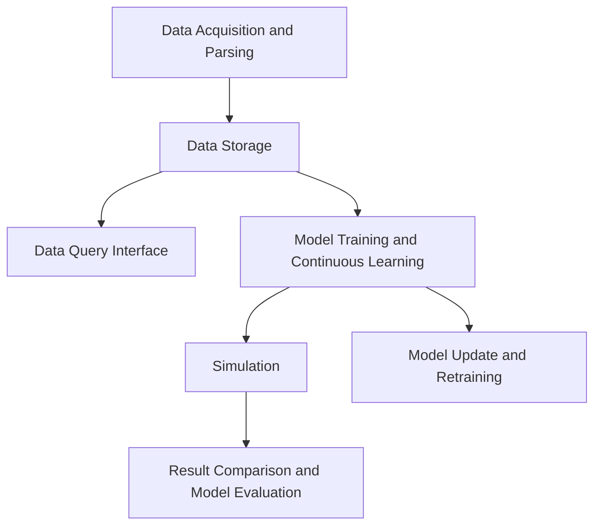

# Architecture Design Document: Sports Outcome Predictor

## Table of Contents

1. Introduction
2. System Overview
3. Component Design
4. Data Flow Diagram
5. Data Storage Strategy
6. Security Considerations

## 1. Introduction

This document describes the overall system architecture of the Sports Outcome Predictor, including the design of components, modules, and their interactions. It also outlines data flow diagrams and data storage strategies.

## 2. System Overview

The Sports Outcome Predictor is a web-based application that ingests various formats of sports-related data, processes and stores it, and uses advanced algorithms like neural networks and forest regression to predict outcomes. The system consists of several components, including data acquisition and parsing, data storage, a data query interface, machine learning model training and continuous learning, simulation, model update and retraining, and result comparison and model evaluation.

## 3. Component Design

### 3.1 Data Acquisition and Parsing

* **Languages & Libraries**: Python, Beautiful Soup, requests, pandas, openpyxl, json, xml.etree.ElementTree
* **Functionality**:
  * Download sports-related data from various sources using the `requests` library.
  * Parse data from different formats into a standardized format.
  * Clean and preprocess the data to remove inconsistencies and missing values.

### 3.2 Data Storage

* **Database**: SQLite or PostgreSQL
* **Languages & Libraries**: Python, SQLAlchemy, psycopg2 (if using PostgreSQL)
* **Functionality**:
  * Design a relational database schema to store the data in different tables based on sport or other ancillary data.
  * Implement database connection and data insertion functions.

### 3.3 Data Query Interface

* **Languages & Libraries**: Python, Flask, SQLAlchemy, pandas
* **Functionality**:
  * Develop a web-based interface to interact with the stored data.
  * Implement filtering and sorting options for the data.
  * Allow users to review and update the stored data through the web interface.

### 3.4 Model Training and Continuous Learning

* **Languages & Libraries**: Python, TensorFlow, Keras, scikit-learn, pandas, NumPy, GitHub Actions
* **Functionality**:
  * Train machine learning models using TensorFlow, Keras, and scikit-learn.
  * Set up a continuous training pipeline with GitHub Actions to automatically retrain models on updated data.
  * Implement evaluation metrics to measure model performance.

### 3.5 Simulation

* **Languages & Libraries**: Python, NumPy, pandas
* **Functionality**:
  * Develop a simulation engine that uses the trained models to run multiple simulations.
  * Customize simulation settings and input parameters.
  * Analyze and store simulation results.

### 3.6 Model Update and Retraining

* **Languages & Libraries**: Python, TensorFlow, Keras, scikit-learn, pandas, NumPy, GitHub Actions
* **Functionality**:
  * Set up a pipeline to regularly update the stored data and retrain the predictive models.
  * Monitor model performance and track improvements over time using evaluation metrics.
  * Automatically update models using GitHub Actions.

### 3.7 Result Comparison and Model Evaluation

* **Languages & Libraries**: Python, pandas, NumPy, SQLAlchemy
* **Functionality**:
  * Design and implement a database table to store actual results data.
  * Compare predicted outcomes with actual results.
  * Evaluate model performance and improve training based on result.

## 4. Data Flow Diagram

A data flow diagram is a graphical representation of how data flows through the system. The diagram represents each component and the flow of data between components. It illustrates how data is acquired, parsed, stored, processed, and utilized within the system. You can create a data flow diagram using various tools such as draw.io, Lucidchart, or Microsoft Visio.

## 5. Data Storage Strategy

* **Database**: SQLite or PostgreSQL
  * Use SQLite for a lightweight, serverless, and easy-to-configure solution.
  * Use PostgreSQL for a more robust, scalable, and feature-rich solution.

* **Data Schema**: Design a relational database schema with tables for different sports and ancillary data. Use primary keys, foreign keys, and indices to optimize data storage and retrieval.

* **Data Backup and Recovery**: Implement a backup and recovery strategy to prevent data loss and ensure data integrity. Regularly create and store database backups in a secure location.

## 6. Security Considerations

* **Data Encryption**: Protect sensitive data by implementing encryption for data stored in the database and data transmitted over the network.

* **Authentication and Authorization**: Implement a user authentication system to restrict access to the data query interface and other protected areas of the application. Use role-based access control to grant different levels of access to users based on their roles.

* **Secure Communication**: Use HTTPS to encrypt data communication between the web server and clients, ensuring data privacy and security.

* **Input Validation**: Validate user input to prevent SQL injection, cross-site scripting, and other malicious attacks.

* **Software Updates**: Keep all software components, libraries, and frameworks up-to-date to ensure the system is protected against known vulnerabilities.

* **Monitoring and Logging**: Implement monitoring and logging mechanisms to detect and respond to security threats, performance issues, and errors.

By following the architecture design and taking the necessary security measures, you can build a robust, secure, and efficient Sports Outcome Predictor.
